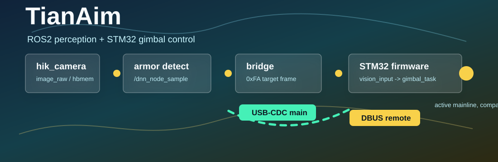

# TianAim

<p align="center">
  
</p>

TianAim is the current integrated workspace for the RDK-X5 ROS2/TROS stack, the STM32 gimbal controller, dataset tooling, and model training assets.

The active runtime chain on board is:

```text
hik_camera
  -> /hbmem_img
  -> rm_armor_detection or rm_vehicle_detection
  -> ai_msgs/msg/PerceptionTargets
  -> rm_gimbal_bridge
  -> USB-CDC / UART
  -> STM32 vision_input
```

## Current status

- `ros2_ws/`: active ROS2 workspace for camera, detectors, bridge, launch scripts, and RDK deployment helpers
- `firmware/stm32_gimbal_control/`: active STM32F407 firmware
- `tools/`: capture, labeling, training, and evaluation helpers
- `datasets/` and `models/`: lightweight manifests, reports, and export metadata
- `archive/`: audit and recovery notes only

## Quick start

Build the ROS2 mainline packages:

```bash
bash scripts/build_ros2_mainline.sh
```

This currently builds:

```text
hik_camera rm_armor_detection rm_vehicle_detection rm_gimbal_bridge
```

Run the bridge-only launch entry:

```bash
bash scripts/run_ros2_bridge.sh
```

For the board-side full autoaim workflow, read [ros2_ws/README.md](ros2_ws/README.md).

## Repository map

```text
.
├── ros2_ws/
├── firmware/stm32_gimbal_control/
├── datasets/
├── models/
├── tools/
├── scripts/
├── assets/
└── archive/
```

Key package entry points:

- `ros2_ws/src/hik_camera/`
- `ros2_ws/src/rm_armor_detection/`
- `ros2_ws/src/rm_vehicle_detection/`
- `ros2_ws/src/rm_gimbal_bridge/`
- `firmware/stm32_gimbal_control/`

## Documentation

- ROS2 runtime and board workflow: [ros2_ws/README.md](ros2_ws/README.md)
- Bridge package notes: [ros2_ws/src/rm_gimbal_bridge/README.md](ros2_ws/src/rm_gimbal_bridge/README.md)
- Vehicle detector notes: [ros2_ws/src/rm_vehicle_detection/README.md](ros2_ws/src/rm_vehicle_detection/README.md)
- Top-level helper scripts: [scripts/README.md](scripts/README.md)

## Maintenance note

When changing package topology, launch arguments, scripts, or runtime topics, update the affected `README.md` files in the same change so the docs stay aligned with the local codebase.
